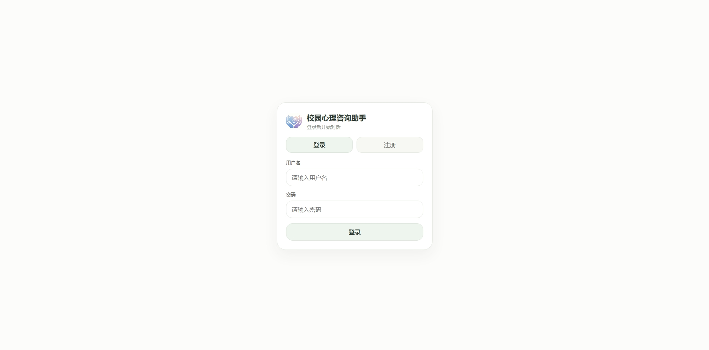
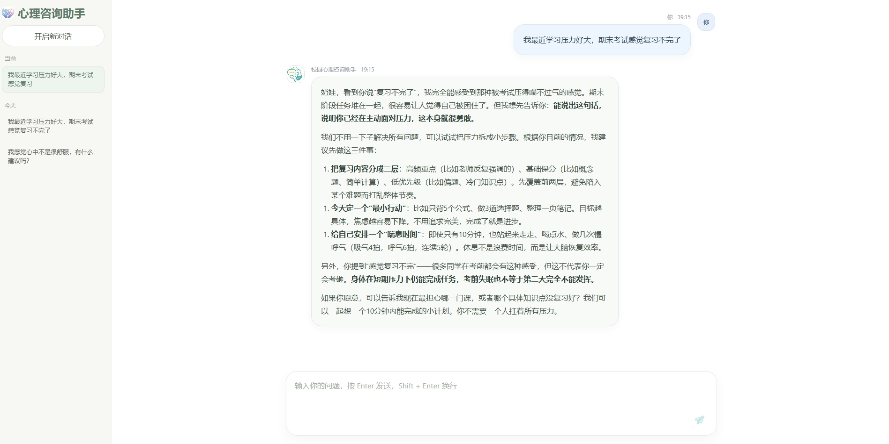

# MindBridge

面向学生的陪伴与校园心理关怀智能体原型。项目重点在于将多阶段对话流程工程化：意图路由、记忆召回、RAG 检索、风险守护、Skill 指引与回复生成，并提供 FastAPI 后端接口（SSE 流式输出）。

## 特性

- LangGraph 编排的多节点对话流程：Memory → Supervisor → Knowledge(RAG) → Risk Guardian → Counselor/Companion
- 意图识别 Prompt 模板：只做分类（CHAT / CONSULT / RISK），不输出回答
- 记忆模块：基于会话历史召回 + 中期压缩摘要，注入模型 history
- RAG：MySQL 存储知识切片 + Chroma 向量库索引，支持向量检索与 BM25 混合检索
- Skill 系统：按意图/风险/关键词加载技能指引（`skills/*/SKILL.md`），注入回复系统提示词
- 后端服务：FastAPI + StreamingResponse（SSE），提供对话流式接口与历史查询
- 多模型后端适配：OpenAI / DeepSeek / Ollama（统一 OpenAI SDK 调用方式）
- 面向“开发过程留痕”的仓库组织：开发日志、关键决策与里程碑版本可追溯

## 界面展示

### 登录页



### 对话页



## 快速开始

### 1. 环境要求

- Python 3.10+
- MySQL 8+（用于会话、消息与知识切片存储）

### 2. 安装依赖

```bash
python -m venv .venv
.venv\Scripts\activate
pip install -r requirements.txt
```

### 3. 配置环境变量

复制示例文件并填写你的 Key：

```bash
copy .env.example .env
```

示例变量见 [.env.example](./.env.example)，主要分为几类：

- LLM 推理：`LLM_BACKEND`、`DEEPSEEK_API_KEY`/`OPENAI_API_KEY` 等
- 数据库：`DATABASE_URL` 或 `MYSQL_HOST/MYSQL_USER/...`
- 鉴权：`JWT_SECRET_KEY`、`JWT_EXPIRE_MINUTES`
- 向量库：`CHROMA_PATH`、`CHROMA_COLLECTION`
- Embedding：`OPENAI_BASE_URL` + `OPENAI_EMBEDDING_MODEL` + `DASHSCOPE_API_KEY/OPENAI_API_KEY`
- 混合检索：`ENABLE_BM25`、`HYBRID_ALPHA`、`HYBRID_GATE_THRESHOLD`、`TOP_K` 等

### 4. 初始化数据库（第一次需要）

1) 创建数据库并导入表结构：

```bash
mysql -u root -p -e "CREATE DATABASE IF NOT EXISTS mindbridge DEFAULT CHARSET utf8mb4 COLLATE utf8mb4_unicode_ci;"
mysql -u root -p mindbridge < SQL/mysql_schema.sql
```

2) 插入一份最小可用的 demo 用户与会话数据：

```sql
INSERT INTO user_accounts (id, username, display_name, password_hash)
VALUES (
  1,
  'test_user',
  'test_user',
  '9f86d081884c7d659a2feaa0c55ad015a3bf4f1b2b0b822cd15d6c15b0f00a08'
);

INSERT INTO chat_sessions (id, public_id, title, user_id)
VALUES (1, 'demo-session', 'Demo Session', 1);
```

### 5. 同步知识库到 MySQL + Chroma（可选但推荐）

把 `knowledge/*.md` 切片并写入 MySQL 与 Chroma：

```bash
python sync_all_knowledge.py
```

查看 Chroma 索引情况：

```bash
python chroma_inspect.py list
python chroma_inspect.py info
python chroma_inspect.py preview --limit 3
```

### 6. 启动后端服务（FastAPI）

```bash
python main.py
```

启动后访问：

- Swagger：`http://127.0.0.1:8000/docs`

### 7. 调用接口（示例）

1) 注册账号并直接获取 Token：

`POST /api/auth/register`

请求体示例：

```json
{
  "username": "alice",
  "password": "123456",
  "displayName": "Alice"
}
```

2) 登录获取 Token：

`POST /api/auth/login`

请求体示例：

```json
{
  "username": "test_user",
  "password": "test"
}
```

3) 获取当前登录用户：

`GET /api/auth/me`

请求头示例：

```text
Authorization: Bearer <accessToken>
```

4) 流式对话（SSE）：

`POST /api/chat/stream`

请求头需要携带 `Bearer Token`，请求体示例（`sessionId` 对应 `chat_sessions.public_id`）：

```json
{
  "sessionId": "demo-session",
  "message": "我最近有点难受"
}
```

5) 会话列表：

`GET /api/chat/history`

6) 获取某个会话的完整对话：

`GET /api/chat/conversation/{publicId}`

## 项目结构（当前）

```text
.
├── main.py                # FastAPI 入口
├── api/                   # 路由层（SSE/历史接口）
├── Agents/                # Agent 编排与运行时
├── Agent_Type/            # Agent 运行上下文与类型定义
├── service/               # 业务服务：DB/记忆/RAG/技能/风险评估/聊天
├── Entities/              # ORM 实体（SQLAlchemy）
├── SQL/                   # MySQL schema
├── knowledge/             # 领域知识库（markdown）
├── ScreenShot/            # README 展示截图
├── skills/                # Skill 指引（SKILL.md）
├── rag_eval/              # 检索评测脚本与数据
├── Test/                  # 测试脚本（RAG/embedding/graph）
├── PromptTemplates.py     # Prompt 模板（意图识别/心理分析/回复系统提示词）
├── sync_all_knowledge.py  # 同步知识库到 MySQL + Chroma
├── chroma_inspect.py      # Chroma 工具：list/info/preview
├── requirements.txt
├── .env.example
└── docs/                  # 过程留痕与文档
```

## 设计原则与安全边界

- 本项目不提供医疗诊断、用药建议，不替代持证心理咨询师
- 面向学生的输出避免“报告口吻”，不向用户展示后台风险分级与标签
- 对高风险信号优先做安全引导：先回应情绪，再建议联系身边可信任的人/学校心理资源/紧急求助渠道

## 路线图（规划）

- RAG：检索增强生成（查询改写、证据注入、答案引用、召回评测）
- MCP：工具调用与外部能力接入（数据源、校园服务、知识库工具）
- Backend：鉴权、会话/用户管理、追踪与审计、任务队列
- 评测：对话质量与安全评测（回归测试、自动化对比）

## 开发过程

- 开发日志：见 [docs/devlog.md](./docs/devlog.md)
- 决策记录：见 [docs/decisions.md](./docs/decisions.md)
- Chroma 使用说明：见 [docs/chroma_cli.md](./docs/chroma_cli.md)

## License

暂未选择许可证（默认 All rights reserved）。若你希望开源协作，可补充 MIT/Apache-2.0 等许可证。
